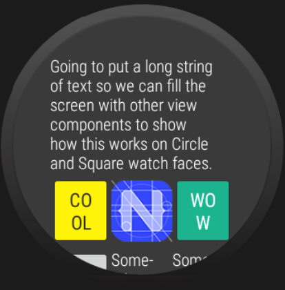
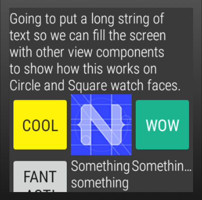
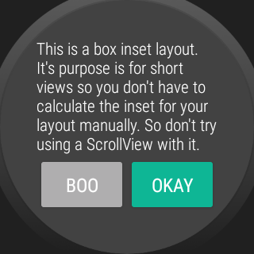
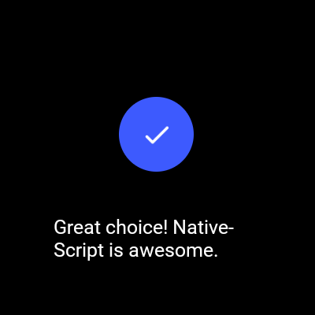
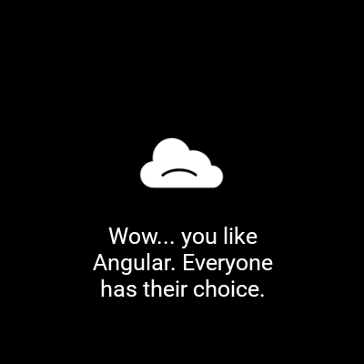

<a align="center" href="https://www.npmjs.com/package/nativescript-wear-os">
    <h3 align="center">NativeScript Wear OS</h3>
</a>
<h4 align="center">
NativeScript-Wear-OS is a NativeScript plugin that provides layouts and utilities specific to WearOS.
</h4>

<p align="center">
  <a href="https://www.npmjs.com/package/nativescript-gif">
        
    </a>
    <a href="https://www.npmjs.com/package/nativescript-wear-os">
        
    </a>
    <a href="https://www.npmjs.com/package/nativescript-wear-os">
        
    </a>
</p>

---

## Installation

NativeScript Version 7+:

```bash
tns plugin add nativescript-wear-os
```

NativeScript version prior to 7:

```bash
tns plugin add nativescript-wear-os@2.1.1
```

---

### Ambient Mode Support

##### Documentation: _https://developer.android.com/training/wearables/apps/always-on_

1. Add the `WAKE_LOCK` permission to your AndroidManifest.xml

```xml
	<uses-permission android:name="android.permission.WAKE_LOCK" />
```

2. Copy the `ambient-activity.ts` in the root of this project's demo app and use it to replace the default Android Activity loaded by NativeScript. [NativeScript docs HERE about using a custom Android Activity.](https://docs.nativescript.org/core-concepts/android-runtime/advanced-topics/extend-application-activity#extending-activity)

3. Update the AndroidManifest.xml for your application to use the correct activity. Change the `android:name` value of the `activity` node to point to the same name used inside the `ambient-activity.ts` file inside the `@JavaProxy()` decorator at the top of the file.

```xml
		<activity android:name="com.nativescript.AmbientActivity" android:label="@string/title_activity_kimera" android:configChanges="keyboardHidden|orientation|screenSize" android:theme="@style/LaunchScreenTheme">
```

4. Update your webpack.config to include the custom Android Activity. Snippet below copied from the demo app.

```javascript
// Add your custom Activities, Services and other Android app components here.
const appComponents = [
  '@nativescript/core/ui/frame',
  '@nativescript/core/ui/frame/activity',
  resolve(__dirname, 'app/ambient-activity'),
];
```

---

### WearOsLayout

A base layout for Wear OS apps built with NativeScript that automatically handles calculating the inset for circle watch faces. To disable the layout from automatically adjusting the inset set `disableInsetConstraint="true"` on the `WearOsLayout` instance. The default is false and does not have to be set.

This has no effect on square watches.

```xml
<Page xmlns="http://schemas.nativescript.org/tns.xsd" actionBarHidden="true"
    xmlns:ui="nativescript-wear-os/packages/wear-os-layout">
    <ui:WearOsLayout disableInsetConstraint="false">
      <ScrollView height="100%">
        <StackLayout>
            <Label text="Going to put a long string of text so we can fill the screen with other view components to show how this works on Circle and Square watch faces." class="c-white" textWrap="true" />
            <GridLayout rows="auto, auto, auto" columns="*, *, *">
                <Button text="Go Back" tap="navBack" class="yellowBtn" row="0" col="0" />
                <Image src="res://icon" stretch="aspectFit" row="0" col="1" />
                <Button text="Wow" class="greenBtn" row="0" col="2" />
                <Button text="Fantastic" row="1" col="0" />
                <Label text="Something something something" class="c-white" row="1" col="1" textWrap="true" />
                <Label text="Something Text" row="1" col="2" />
                <Button text="Yay" row="2" col="0" />
                <Image src="res://icon" stretch="aspectFit" row="2" col="1" />
                <Button text="Okay" row="2" col="2" />
            </GridLayout>
          </StackLayout>
        </ScrollView>
    </ui:WearOsLayout>
</Page>
```

| Circle Watch                                                |                        Square Watch                         |
| ----------------------------------------------------------- | :---------------------------------------------------------: |
|  |  |

---

### WearOsListView

```xml
<Page xmlns="http://schemas.nativescript.org/tns.xsd"
  xmlns:wear="nativescript-wear-os/packages/listview">
  <StackLayout>
    <wear:WearOsListView useScalingScroll="true" height="100%" items="{{ items }}">
      <wear:WearOsListView.itemTemplate>
        <GridLayout rows="*" columns="auto, *">
          <Image src="{{ image }}" row="0" col="0" />
          <Label text="{{ title }}" row="0" col="1" />
        </GridLayout>
      </wear:WearOsListView.itemTemplate>
    </wear:WearOsListView>
  </StackLayout>
</Page>
```

##### API

_useScalingScroll_ - If true, the items in the listview will scale during the scroll layout change event.


---

### BoxInsetLayout

```xml
<Page xmlns="http://schemas.nativescript.org/tns.xsd" loaded="pageLoaded" actionBarHidden="true"
    xmlns:ui="nativescript-wear-os/packages/box-inset-layout">
    <ui:BoxInsetLayout>
        <StackLayout height="100%" width="100%">
            <Label text="This is a box inset layout. It's purpose is for short views so you don't have to calculate the inset for your layout manually. So don't try using a ScrollView with it." class="text-white" textWrap="true"/>
            <GridLayout rows="50" columns="*, *">
                <Button col="0" text="Go Back" class="greyBtn" tap="navBack" />
                <Button col="1" text="Okay" class="yellowBtn" />
            </GridLayout>
        </StackLayout>
    </ui:BoxInsetLayout>
</Page>
```



### Dialogs

This plugin uses an Android WearOS specific library [SmartWearOs](https://github.com/bradmartin/SmartWearOs).

The plugin has a success dialog and failure/error dialog to present on WearOS. These mimic the behavior of the built in Confirmation Activity on WearOS. With the option of setting the time before it is dismissed/hidden from the user.

#### Usage

```typescript
import {
  showFailure,
  showSuccess,
} from 'nativescript-wear-os/packages/dialogs';

showSuccess('Great choice! NativeScript is awesome.', 4).then(() => {
  console.log('success dialog complete.');
});
```




## [Change Log](./CHANGELOG.md)
